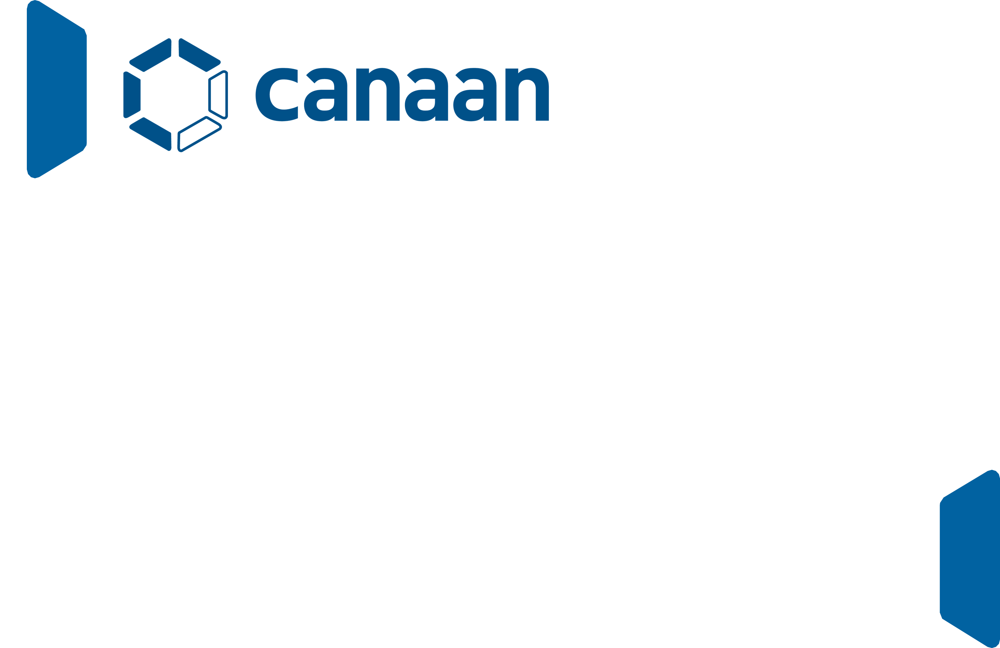
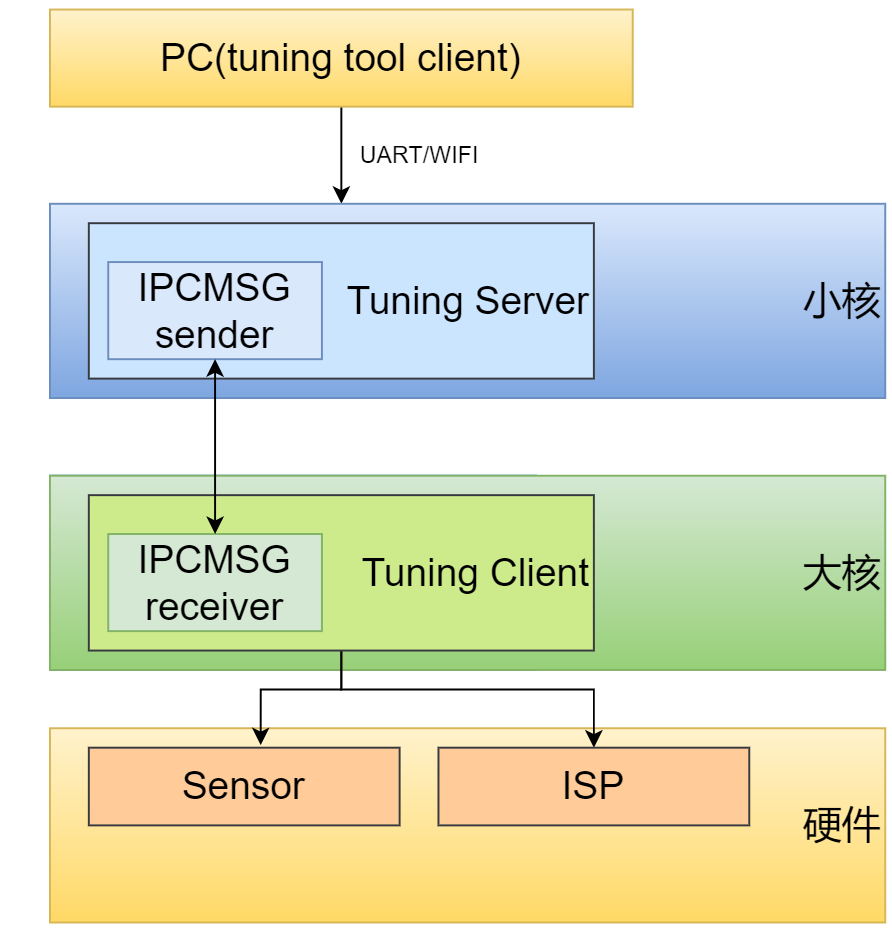
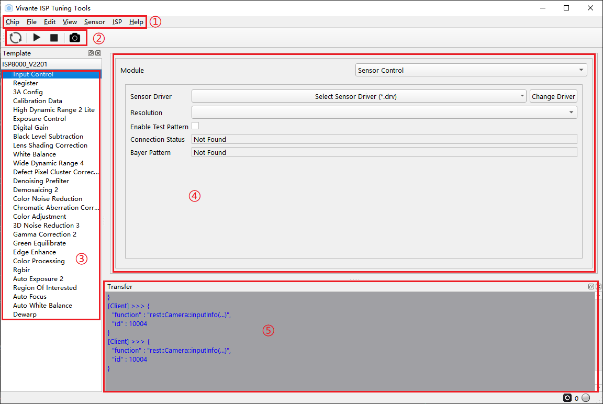
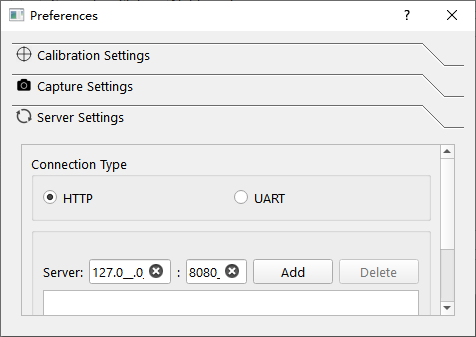
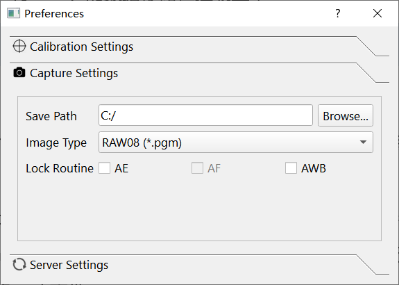

# K230 SDK Tuning Tool使用指南

版权所有©2023北京嘉楠捷思信息技术有限公司

## 免责声明

您购买的产品、服务或特性等应受北京嘉楠捷思信息技术有限公司（“本公司”，下同）及其关联公司的商业合同和条款的约束，本文档中描述的全部或部分产品、服务或特性可能不在您的购买或使用范围之内。除非合同另有约定，本公司不对本文档的任何陈述、信息、内容的正确性、可靠性、完整性、适销性、符合特定目的和不侵权提供任何明示或默示的声明或保证。除非另有约定，本文档仅作为使用指导参考。

由于产品版本升级或其他原因，本文档内容将可能在未经任何通知的情况下，不定期进行更新或修改。

## 商标声明

、“嘉楠”和其他嘉楠商标均为北京嘉楠捷思信息技术有限公司及其关联公司的商标。本文档可能提及的其他所有商标或注册商标，由各自的所有人拥有。

**版权所有 © 2023北京嘉楠捷思信息技术有限公司。保留一切权利。**
非经本公司书面许可，任何单位和个人不得擅自摘抄、复制本文档内容的部分或全部，并不得以任何形式传播。

## 目录

[TOC]

## 前言

### 概述

本文档描述了Tuning Tool的使用说明。

### 读者对象

本文档（本指南）主要适用于以下人员：

- 技术支持工程师
- 软件开发工程师

### 缩略词定义

| 简称 | 说明                                                       |
|------|------------------------------------------------------------|
| BLS  | Black Level Subtraction                                    |
| HDR  | High Dynamic Range                                         |
| 3A   | AE(Auto Exposure)、AF(Auto Focus)、AWB(Auto White Balance) |
| DG   | Digital Gain                                               |
| LSC  | Lens Shading Correction                                    |
| WB   | White Balance                                              |
| DM   | Demosaic                                                   |
| DPCC | Defect Pixel Cluster Correction                            |
| DPF  | Denoising Prefilter                                        |
| CNR  | Color Noise Reduction                                      |
| CAC  | Chromatic Aberration Correction                            |
| CA   | Color Adjustment                                           |
| 2DNR | 2D Noise Reduction                                         |
| 3DNR | 3D Noise Reduction                                         |
| GC   | Gamma Correction                                           |
| GE   | Green Equilibrate                                          |
| EE   | Edge Enhance                                               |
| CP   | Color Processing                                           |
| ROI  | Region Of Interested                                       |
| DW   | De-warp                                                    |
| TS   | Tuning-Server                                              |
| TC   | Tuning-Client                                              |

### 修订记录

| 文档版本号 | 修改说明                          | 修改者 | 日期       |
|------------|-----------------------------------|--------|------------|
| V1.0       | 初版                              | 郭世栋 | 2023-02-20 |
| V1.1       | 更新部分功能描述                  | 刘家安 | 2023-04-07 |
| V1.2       | 更新部分功能描述 新增部分功能描述 | 郭世栋 | 2023-05-05 |

## 1. 模块软件架构

图1-1

## 2. Tuning Tool的连接及启用

### 2.1 工具获取路径

| **文件名**                                | **存放位置**                                                                                                 | **功能**                                            |
|-------------------------------------------|--------------------------------------------------------------------------------------------------------------|-----------------------------------------------------|
| PC tuning-tool软件包（tuning-client.exe） | relaese的源码包k230_sdk/tools/tuning-tool-client/Kendyte_ISP_Tool_TuningClient_RC22.5_Pre_596062-20221116.7z | 用于图像dump，ISP调试等PC端工具                     |
| tsconfig.json                             | 小核文件系统 /app/tuning-server/                                                                             | DUMP数据用配置文件                                  |
| run_tuning_server.sh                      |  小核文件系统 /app/tuning-server/                                                                                                            | 启动tuning-server脚本                               |
| 3aconfig.json                             |      小核文件系统 /app/tuning-server/                                                                                                        | 3a模块的配置参数                                    |
| tuning-server                             | 小核文件系统 /app/tuning-server/                                                                                                             | tuning-server可执行程序，被run_tuning_server.sh调用 |
| sample_sys_init.elf                       | 大核/bin/                                                                                                    | ISP demo（包含少部分ISP功能，已经不再使用）         |
| sample_vicap_dump.elf                     | 大核/bin/                                                                                                    | 基于VICAP的ISP demo（包括基本ISP pipeline）         |
**表2-1 文件列表**

### 2.2 环境编译

Tuning-tool依赖板端小核系统的tuning-server程序通信，依赖板端大核系统的ISP demo，demo由sample_sys_init.elf替换为sample_vicap_dump.elf，包含基本ISP pipeline功能。

根据release源码包中的README.md编译出镜像，烧写至板端。Tuning-server相关组件以及应用程序将存放在小核/app/tuning-server和/lib/tuning-server中。

### 2.3 启动流程

1. 板端小核配置IP
1. 板端小核插入k_ipcm.ko模块，cd /mnt; insmod k_ipcm.ko
1. 板端小核启动tuning-server
1. 板端大核启动ISP demo，cd /bin/; ./sample_vicap_dump.elf -dev \<dev_num\> -sensor \<sensor_num\> -chn \<chn_num\> -ofmt \<out_format\> -preview \<display_enable\>
1. PC端启动tuning-tool-client

### 2.4 修改配置文件

#### 2.4.1 小核

1. tsconfig.json

用于配置DUMP功能的图像数据参数，默认基于ov9732（目前仅支持ov9732）。
修改“convert_to_Bmp”为1时，将dump的数据保存BMP并发送到PC指定保存目录，此时预览窗口将显示BMP。
修改“convert_to_Bmp”为0时，将dump的原始数据（yuvNV12）保存并发送到PC指定保存目录，此时预览窗口将无法显示。

| **关键字**     | **默认值**                | **功能**                                                                                                                 |
|----------------|---------------------------|--------------------------------------------------------------------------------------------------------------------------|
| Width          | 1280                      | DUMP图像的宽                                                                                                             |
| Height         | 720                       | DUMP图像的高                                                                                                             |
| Align          | 1                         | 对齐字节数                                                                                                               |
| stride         | 1280                      | 对齐后的数据宽度                                                                                                         |
| pixel_format   | 27                        | DUMP图像格式，27/30: YUV NV12                                                                                            |
| insert_pic     | 0                         | 插帧测试，0：关闭，1：开启，默认关闭                                                                                     |
| convert_to_Bmp | 1                         | DUMP后的图像转换为BMP，默认开启，将在tuning-tool中显示转换后的BMP，关闭后将不进行转换，tuning-tool显示窗口将无法显示图像 |
| bayer_pattern  | 1                         | 0: BGGR，1: RGGB，默认RGGB，暂时不生效                                                                                   |
| insertFilename | NON                       | 插帧测试文件全路径: 默认为空即可                                                                                         |
| save_path      | /app/tuning-server/mount/ | DUMP数据在板端的存储路径，板端无mount目录，需自行创建                                                                    |
| dev_num        | 0                         | 设备ID编号，默认0，0：sensor0， 1：sensor1                                                                               |
| chn_num        | 0                         | 绑定通道编号，默认0                                                                                                      |
| exp_type       | 0                         | sensor曝光模式，当前不生效，默认为0                                                                                      |
**表2-2 配置参数说明**

1. run_tuning_server.sh，用于启动tuning-server，直接按照步骤3)执行即可。
1. 启动tuning-server，cd /app/tuning-server; ./run_tuning_server.sh

#### 2.4.2 大核

1. RT-Smart启动ISP-demo

> cd /bin/; ./sample_vicap_dump.elf
ISP-demo启动方法
./sample_vicap_dump.elf -dev \<dev_num\> -sensor \<sensor_num\> -chn \<chn_num\> -ofmt \<out_format\> -preview \<display_enable\>
./sample_vicap_dump.elf -dev 0 -sensor 0 -chn 0
./sample_vicap_dump.elf -dev 0 -sensor 2 -chn 0
通过指定sensor num决定使用哪个sensor配置，preview开关决定是否进行预览

#### 2.4.3 PC tuning tool

1. 启动tuning-tool

打开release的tuning-tool工具包中的tuning-client.exe。路径为：k230_sdk/tools/tuning-tool-client/Kendyte_ISP_Tool_TuningClient_RC22.5_Pre_596062-20221116.7z
参照章节3.1配置IP即可。

## 3. Tuning Tool界面介绍

图3-1

如图3-1所示为tuning-tool-client的基本操作UI全部展开后共五个区域

① 菜单操作区域：用于ISP的选择、参数导入/导出、通信连接配置

② 图像操作区域：抓取图像

③ 功能区域：用于ISP各模块UI的切换

④ 调试区域：用于调试某一个模块的参数

⑤ 回显区域：用于打印部分参数下发和接收的日志

### 3.1 连接板端tuning-server

#### 3.1.1 使用HTTP方式连接板端tuning-server

图3-2

SDK默认支持HTTP方式连接，依次点击Edit-\>Preferences-\>Server Settings将弹出配置窗口，如图3-2，图3-3。

图3-3

选择HTTP模式，保证PC与板端连接的网络处于同一网段，在Server的第一项指定板端的IP，第二项指定端口默认即可，依次点击add-\>apply后关闭窗口即可完成配置，如果板端tuning-server已经启动，则会自动完成连接，任意切换图3-1中③区域的模块，则会看到tuning-server端的函数打印。

### 3.2 在线调试界面及功能描述

本节只是简单介绍一些tuning tool界面上调试模块的主要功能，具体的调试策略及步骤将在以后的图像调优文档中进行详细的描述。

#### 3.2.1 Input Control

Sensor Driver：选择sensor的驱动配置.drv

Resolution：sensor配置出图的resolution

Enable Test Pattern：是否打开sensor test pattern

Connection Status：查看连接状态

Bayer Pattern: bayer排序

#### 3.2.2 Register

支持用户对ISP的寄存器进行读写。

支持对sensor寄存器的读写，目前默认对sensor0进行读写，若读写sensor1，需要配置tsconfig.json中dev_num参数为1即可。

#### 3.2.3 3A Config

目前未使用，已分解到其他地方。

#### 3.2.4 Calibration Data

将标定工具生成的xml文件导入并显示在界面上。

#### 3.2.5 High Dynamic Range 2

暂未支持。

#### 3.2.6 Exposure Control

支持获取自动曝光和增益，支持通过工具界面设置曝光和增益，设置时需要关闭自动曝光功能。

#### 3.2.7 Digital Gain

用于对ISP Digital Gain使能控制及调节大小。

#### 3.2.8 Black Level Subtraction

提供与Sensor相关的黑电平校正，可对R、Gr、Gb、B四通道进行设置。

#### 3.2.9 Lens Shading Correction

提供镜头阴影校正，校准系数由标定工具生成。

#### 3.2.10 White Balance

提供白平衡R、Gr、Gb、B四通道增益设置；

通过调节3x3 CCM矩阵及偏移量可完成颜色偏差的校准。

#### 3.2.11 Wide Dynamic Range 4

提供对图像全局和局部对比度的调整。

#### 3.2.12 Defect Pixel Cluster Correction

提供对像素坏点的检测及校准的功能，通过选择set可设置不同的校准方法。

#### 3.2.13 Denoising Prefilter

双边滤波降噪模块。

#### 3.2.14 Demosaicing 2

通过插值将Bayer格式的Raw图转为RGB图，并提供去摩尔纹、去紫边、锐化及降噪处理功能。

#### 3.2.15 Color Noise Reduction

未支持。

#### 3.2.16 Chromatic Aberration Correction

用于校准主要由镜头引入的色差，由标定工具生成校准参数。

#### 3.2.17 Color Adjustment

分为CA和DCI两块。

CA模块用于调节图像的饱和度。根据图像亮度或者原饱和度的变化来调整饱和度，达到局部调整饱和度的目的，让亮区域的颜色更鲜艳以及消除暗区域或低饱和度区域的彩噪。

DCI模块实现对图像的动态对比度调整。

#### 3.2.18 3D Noise Reduction 3

通过调整参数配置，对图像降噪强度的调节。

#### 3.2.19 Gamma Correction 2

支持客户自定义gamma，该模式下可更改gamma指数。

#### 3.2.20 Green Equilibrate

校准Gr与Gb两通道的不平衡，可设置不同的绿平衡强度。

#### 3.2.21 Edge Enhance

用于提升图像的清晰度。通过设置合适的参数，提升图像清晰度的同时，也可抑制噪声的增强。

#### 3.2.22 Color Processing

颜色处理模块，可调节图像的对比度、亮度、饱和度及色调，设置不同的颜色喜好或风格。

#### 3.2.23 Rgbir

暂未支持。

#### 3.2.24 Auto Exposure 2

工具界面暂不支持调节自动参数。

#### 3.2.25 Region Of Interested

支持通过工具设置8个ROI窗口，第一次设置窗口数量超过1后，将不能再关闭ROI模式，ROI数量最少1个。开启ROI模式需要，需要在Auto Exposure2模块Scene Evaluation Mode中选择FIX模式并enable AE才能开启ROI模式。

#### 3.2.26 Auto Focus

因涉及到自动功能，暂未支持。

#### 3.2.27 Auto White Balance

因涉及到自动功能，暂未支持。

#### 3.2.28 Dewarp

已经移到单独的Dewarp tool里。

### 3.3 抓取图片

#### 3.3.1 选择保存目录

图3-4

点击菜单-\>Edit-\>preferences，弹窗如图3-4，点击Capture Settings，点击Browser按钮，选择保存数据的路径，关闭窗口即可。

#### 3.3.2 采集图像

当前仅支持dump 8bit yuvNV12格式数据，点击，等待预览窗口弹出，即可将转换为BMP的图像传送至设置的保存路径中，并显示，原始yuv数据则存放在文件系统中。

如果yuv和BMP数据都需要，可以考虑使用挂载盘或者tftp等功能将数据发出。如果使用挂载方式。在tsconfig.json中修改"save_path"值，默认"save_path": "/app/tuning-server/mount/"，可以修改tuning-server dump数据时原始数据的存储路径，可将路径设置为挂载目录，直接会将yuv和BMP文件存储在该路径下。

如果不需要BMP数据，仅使用yuv数据，则可以在tsconfig.json中设置"convert_to_Bmp": 0，关闭转换BMP功能，这样yuv数据将直接发送至PC，预览窗口将不再显示图像。

板端存储空间有限，在dump一定帧数后将无法dump，需要手动清理数据后再执行该功能。

tsconfig.json文件可直接修改，保存后执行sync命令，此时capture功能将更新，无需退出tuning-server后再修改。

### 3.4 参数的导入与导出

#### 3.4.1 参数导入

工具默认支持导入的参数文件为标准xml格式，分为标定参数和tuning参数两部分，支持PC本地和远程（板端本地）导入。

依次点击File-\>Import All Settings-\>Local/Remote即可在弹出的窗口中选择需要导入的参数xml文件，如图3-5所示。在tuning-tool-client中默认自带多种sensor的参考xml，可用于进行测试。也可在板端Linux文件系统中导入提前存放的xml文件。

图3-5

#### 3.4.2 参数导出

工具默认导出方式会将标定参数和在线调试参数两部分汇总为一个xml文件存放。

依次点击File-\>Export All Settings后，将在板端保存isp-yyyy-MM-dd_HH-mm-ss.xml文件，如：isp-2023-02-07_11-13-17.xml。
