# K230 USB应用实战-UVC传输YUV及编码码流


版权所有©2023北京嘉楠捷思信息技术有限公司

<div style="page-break-after:always"></div>

## 免责声明

您购买的产品、服务或特性等应受北京嘉楠捷思信息技术有限公司（“本公司”，下同）及其关联公司的商业合同和条款的约束，本文档中描述的全部或部分产品、服务或特性可能不在您的购买或使用范围之内。除非合同另有约定，本公司不对本文档的任何陈述、信息、内容的正确性、可靠性、完整性、适销性、符合特定目的和不侵权提供任何明示或默示的声明或保证。除非另有约定，本文档仅作为使用指导参考。

由于产品版本升级或其他原因，本文档内容将可能在未经任何通知的情况下，不定期进行更新或修改。

## 商标声明

、“嘉楠”和其他嘉楠商标均为北京嘉楠捷思信息技术有限公司及其关联公司的商标。本文档可能提及的其他所有商标或注册商标，由各自的所有人拥有。

**版权所有 © 2023北京嘉楠捷思信息技术有限公司。保留一切权利。**
非经本公司书面许可，任何单位和个人不得擅自摘抄、复制本文档内容的部分或全部，并不得以任何形式传播。

<div style="page-break-after:always"></div>

## 概述

本文将讲解如何在k230开发板上实现USB摄像头功能。也就是把K230 开发板连接到电脑，电脑可以通过播放器播放K230摄像头采集到的图像。

## 1. 环境准备

### 1.1 硬件环境

- K230-UNSIP-LP3-EVB-V1.0/K230-UNSIP-LP3-EVB-V1.1
- Ubuntu PC 20.04
- Typec USB线 * 1 至少
- USB TypeC转以太网(如果使用TFTP加载和NFS文件系统)
- 网线一根
- SD卡(如果使用SD卡启动，或软件需要访问SD卡)

### 1.2 软件环境

k230_sdk中提供了工具链，分别在如下路径。

- 大核rt-samrt工具链

``` shell
k230_sdk/toolchain/riscv64-linux-musleabi_for_x86_64-pc-linux-gnu
```

- 小核linux工具链

``` shell
k230_sdk/toolchain/Xuantie-900-gcc-linux-5.10.4-glibc-x86_64-V2.6.0
```

也可通过以下链接下载工具链

``` shell
wget https://download.rt-thread.org/rt-smart/riscv64/riscv64-unknown-linux-musl-rv64imafdcv-lp64d-20230222.tar.bz2
wget https://occ-oss-prod.oss-cn-hangzhou.aliyuncs.com/resource//1659325511536/Xuantie-900-gcc-linux-5.10.4-glibc-x86_64-V2.6.0-20220715.tar.gz
```

## 2. SDK UVC demo体验

### 2.1 release sdk编译固件，烧录固件

参考 [K230_SDK_使用说明](../../01_software/board/K230_SDK_使用说明.md) 2/3/4/5章节描述

### 2.2 执行命令测试demo

参考 [K230_SDK_Demo使用指南](../../01_software/board/examples/K230_SDK_Demo使用指南.md) 2.9 UVC_demo 章节

## 3. 如何开发UVC功能

### 3.1 USB/UVC协议

### 3.1.1 USB协议

USB协议内容比较多，是用得非常普遍的接口，互联网上资料很多。本文只描述一些我认为有助于对USB协议理解的点。

USB2.0有4条线，VBUS/GND/D+/D-，差分信号传输。低速/全速使用3.3V电压，高速使用400mV电压。除了传递数据的差分0/1信号外，其他的一些电压组合可以用来作为速度识别，空闲、复位、唤醒等信号。

PHY可以理解为做一个并转串的操作，把UTMI+信号转成D+/D-的差分信号。


理论上两条数据信号完全可以使用gpio来进行控制，只是协议太复杂，且gpio的变化速度太慢。无论是SPI/SDIO/UART/IIC等等这些接口控制器都是这样，控制器尽可能提供给软件必要的接口，且让软件做尽可能少的操作。USB控制器也就是把协议的功能尽可能让硬件来做，比如速度协商，收到数据包后自动产生应答包等等功能。提供一些寄存器接口告知软件当前USB通信的状态。当然最重要的是提供传输数据的接口，让软件可以收发不同的数据，收发数据一般都会使用DMA。

USB传输数据是以包为基本单位的。下图为包的构成


PID决定了包的类型，令牌包、数据包、握手包和特殊包，不同的包类型包含的字段成分不一样，比如数据包只包含PID+数据+CRC，握手包只有PID。

包组成了事务，令牌包+数据包(可选)+握手包(可选)。下图使用南京沁恒出的USB2.0高速总线分析仪捕获的USB交互信息，如果想捕获USB线上的数据比较推荐这款仪器。

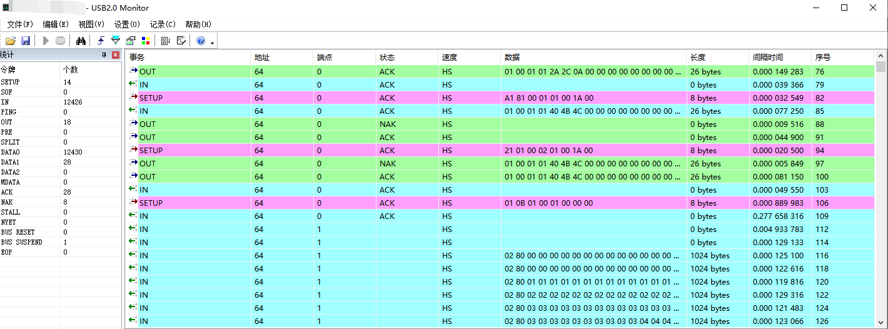

可以看到前面是枚举传输，包含SETUP事务，数据IN/OUT事务，状态IN/OUT事务。后面是同步传输，包含数据IN事务。

传输是由单次或多次事务组成，有4种传输类型：

控制传输-在枚举阶段使用，所有的USB设备连接主机时，都需要一套统一的协议去识别各种USB设备类型。USB控制器初始阶段会让0端点为双向控制端点。

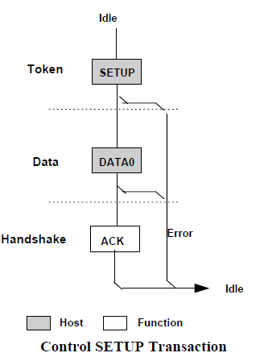

中断传输-小数据量和不连续，且实时性要求高的场合。比如鼠标键盘。

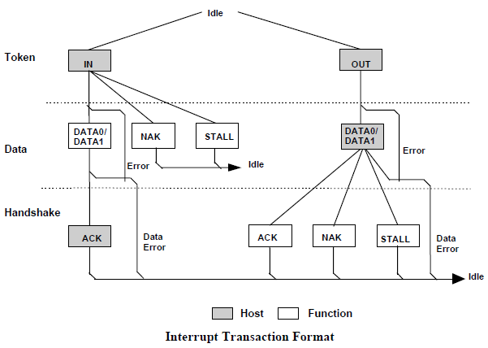

同步传输-数据量大、连续，且要求实时性的场合。比如USB摄像头设备。

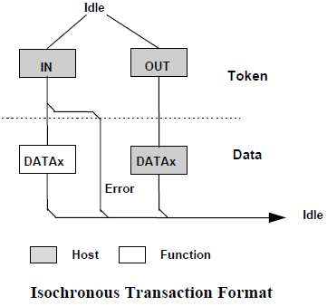

批量传输-用于数据量大，但没有实时性要求的场合。比如U盘设备。

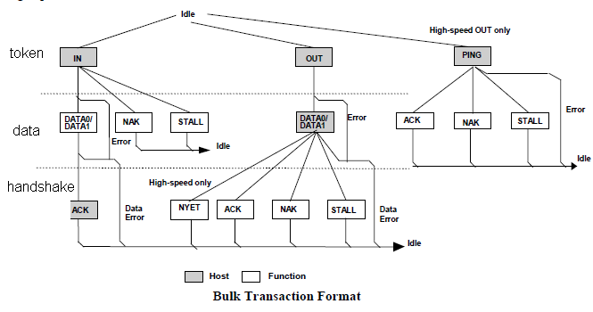

无论是什么样的USB设备协议，都是通过这4种传输来实现的。所以像linux这样的操作系统的USB协议栈，提供了这4种传输方式的接口。

### 3.1.2 UVC协议

### 3.1.2.1 UVC描述符

USB的描述符用于让主机知道设备的属性信息。设备刚连接主机时，主机会发送所有设备都支持的请求命令。通用的描述符包含设备描述符、配置描述符、接口描述符、端点描述符、字符串描述符。不同的设备类型可能会定义特有的描述符，用于对设备的描述扩展。

windows上可以使用UsbTreeView软件查看USB设备的描述符。下图展示了一个UVC设备其描述符的整体布局。

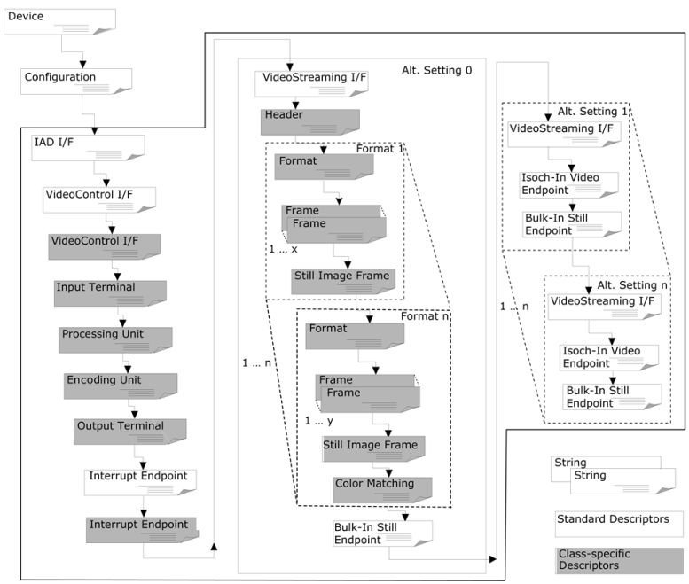

在该布述符布局中，首先第一项是设备描述符，其次是配置描述符，该设备拥有一个配置描述符。配置描述符后接一个接口关联描述符IAD,接口关联描述符IAD拥有一个视频控制接口VC和N个视频流接口。

视频控制接口包括视视频控制接口头描述符、输入终端描述符、处理单元描述符、编码单元描述符、输出终端描述符、中断断点描述符。

视频流接口中包括一个接口和与其对应的多个转换设置接口（Alternate Setting）。

主机端通过视频控制接口描述符，可以知晓UVC摄像头的拓扑结构，并进行控制。比如处理单元PU，包括背光、对比度、色度等等调节，主机端先通过描述符获知哪些是可调节项，然后再与UVC设备交互获知控制范围信息。

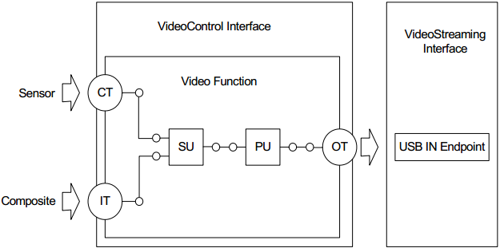

### 3.1.2.2 UVC视频流格式选择

VS接口包含许多Format(YUV/MJPEG/H264等)，每个Format包含多个Frame(各种分辨率)。参数设置的过程需要主机和USB设备进行协商， 协商的过程大致如下图所示：


流程说明：

- Host 先将期望的设置发送给USB设备(PROBE)
- 设备将Host期望设置在自身能力范围之内进行修改，返回给Host(PROBE)
- Host 认为设置可行的话，Commit 提交(COMMIT)
- 设置接口的当前设置为某一个设置

### 3.1.2.3 UVC视频流负载

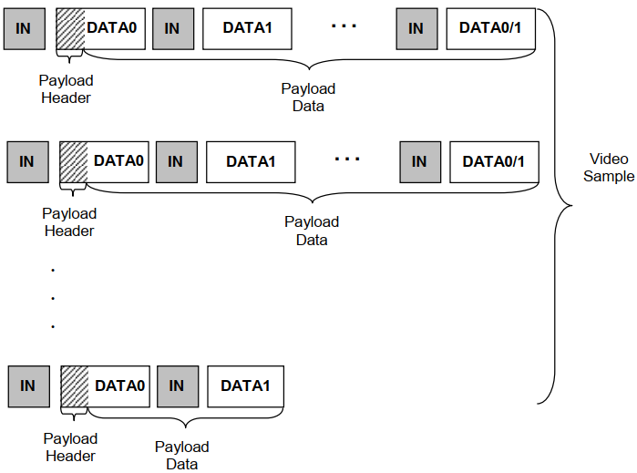

可以看到payload data前面包含一个header，payload data包含多个USB包，主机端是如何识别一帧图像数据的呢？通过payload header来识别。

payload header固定前2字节和后面的扩展部分。重点关注FID-不同的格式规定有差异。但所有的格式都是使用该bit在0和1之间切换来识别新一帧图像数据的。

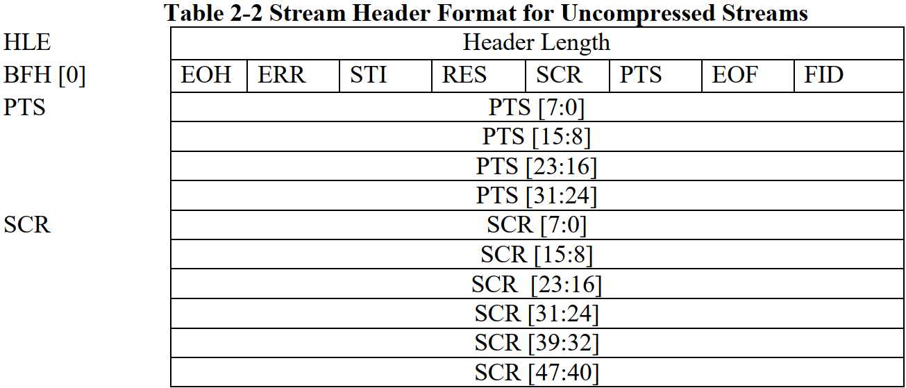

### 3.2 linux驱动层

K230的SDK设计，为了性能把视频音频功能放在大核RTT上。linux上USB的功能实现很成熟，所以基于linux开发UVC功能，通过核间mapi通信获取大核视频数据。

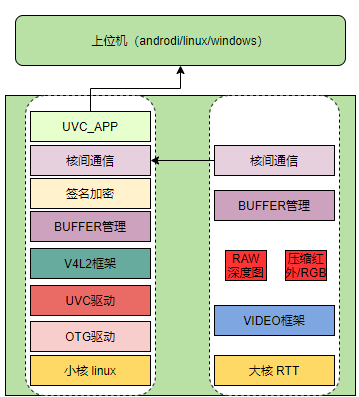

### 3.2.1 控制器驱动

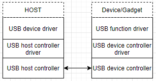

K230集成了新思科技的USB模块，linux/drivers/usb/dwc2目录为该控制器的驱动。

目前的SDK设计UVC固定使用USB1，otg通过ID信号识别为device模式。

platform.c，做一些复位，注册中断，配置参数等操作。SDK的USB默认支持buffer DMA模式。Scatter Gather DMA模式可以提升ISO传输性能，HOST模式使用该DMA模式不能支持HUB。

gadget.c，重点关注该驱动代码，dwc2_gadget_init初始化重要的结构体，gadget.ops和ep.ops。usb_ep_ops的queue就是提交数据收发的请求，实际上是把这个请求放到一个处理链表。USB会挨个处理这些链表上的请求然后上报完成回调。

``` c
//设备树
usbotg1: usb-otg@91540000 {
    compatible = "kendryte,k230-otg";
    reg = <0x0 0x91540000 0x0 0x10000>;
    interrupt-parent = <&intc>;
    interrupts = <174>;
    g-rx-fifo-size = <512>;
    g-np-tx-fifo-size = <64>;
    g-tx-fifo-size = <512 1024 64 64 64 64>;
    dr_mode = "otg";
    otg-rev = <0x200>;
};
```

### 3.2.2 gadget驱动

源码位于linux/drivers/usb/gadget

- legacy：整个Gadget 设备驱动的入口。位于driver/usb/gadget/legacy下，里面给出了常用的usb类设备的驱动sample。其作用就是配置USB设备描述符信息，提供一个usb_composite_driver, 然后注册到composite层。也可以通过functionfs动态创建，这种方式更灵活，K230提供的usb gadget demo都是采用这种方式。
- functions：各种usb 子类设备功能驱动。位于driver/usb/gadget/functions,里面也给出了对应的sample。其作用是配置USB子类协议的接口描述以及其他子类协议，比如uvc协议，hid等。uvc涉及到的相关文件uvc_video.c、uvc_v4l2.c、uvc_queue.c、uvc_configfs.c、f_uvc.c

K230的UVC几乎未对gadget驱动层做修改，仅仅是移植了支持H264格式功能和扩展单元。

linux编译内核添加USB Gadget框架

``` shell
-> Device Drivers
    -> USB support
        -> USB Gadget Support
```


uvc涉及到v4l2模块的功能，还需要添加media框架

``` shell
-> Device Drivers
    -> Multimedia support
        -> Media core support
            -> Media core support
```


### 3.3 uvc-gadget应用层

从K230的SDK设计架构可以看到，K230的UVC功能与单纯的linux上的uvc功能的差别就是获取视频数据的方式是通过核间通信从大核RTT获取的。

K230 UVC应用层的代码位置：cdk/user/mapi/sample/camera

源代码文件描述:

application.c - 主函数

camera.c - 提供摄像头对象操作，可以包含uvc/uac的控制

frame_cache.c - 复杂buffer的管理

kstream.c - 实现视频流操作

kuvc.c - 实现kuvc对象操作

sample_venc.c - 通过mapi从大核获取编码图像的操作

sample_yuv.c - 通过mapi从大核获取YUV图像的操作

uvc-gadget.c - 实现uvc设备操作

调试的步骤是先移植linux上通用的uvc_app，在linux上跑通standalone功能，也就是播放固定图像数据。然后再调试播放真实摄像头图像数据的功能。

下面是K230 UVC APP的设计流程图

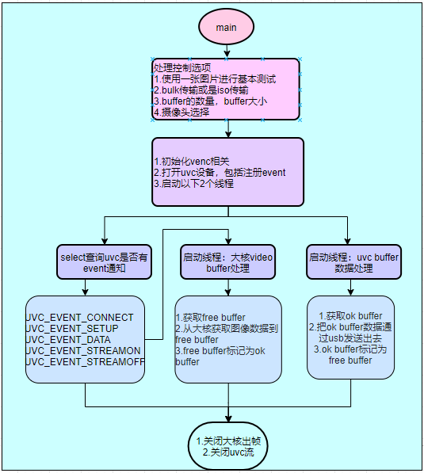

uvc app大部分操作都是通用的操作，互联网上资料比较多。这里说一下K230私有的操作，重点关注venc_normalp_classic函数的处理。

- 首先配置vicap 设备属性信息，包括摄像头类型等
kd_mapi_vicap_set_dev_attr
- 获取摄像头信息，主要是获取摄像头输出的图像分辨率 k_vicap_sensor_info
- 根据需要从vicap输出的图像计算出需要的vb buffer大小，并分配好buffer kd_mapi_media_init
- 配置通道属性，包括输出的分辨率，格式等 kd_mapi_vicap_set_chn_attr
- 启动video处理 kd_mapi_vicap_start
  - 获取一帧图像 kd_mapi_vicap_dump_frame
  - 释放图像 buffer kd_mapi_vicap_release_frame
- 初始化venc模块，包括编码格式，帧率，分辨率等等 kd_mapi_venc_init
- 注册编码完成后的回调函数 kd_mapi_venc_registercallback
- 使能H264 GOP间隔产生IDR帧 kd_mapi_venc_enable_idr
- 启动venc kd_mapi_venc_start
- venc模块绑定vi模块 kd_mapi_venc_bind_vi
  - 编码完成后的回调函数，获取编码后的图像数据 get_venc_stream

### 3.4 参考资料学习推荐

- [USB2.0官方文档下载](https://www.usb.org/document-library/usb-20-specification)
- [UUV1.1官方文档下载](https://www.usb.org/document-library/video-class-v11-document-set)
- [UUV1.5官方文档下载](https://www.usb.org/document-library/video-class-v15-document-set)
- [USB中文网](https://www.usbzh.com/article/forum-12.html)
